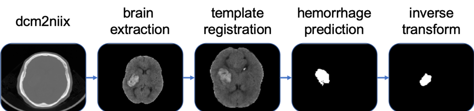

<!-- badges: start -->
[](https://travis-ci.com/msharrock/deepbleed)
<!-- badges: end -->

Please see our [MedRxiv Paper](https://www.medrxiv.org/content/10.1101/2020.03.05.20031823v1) for more information and cite (currently) if using in publications:

Sharrock, M., Mould, W. A., Ali, H., Hildreth, M., Hanley, D. F., & Muschelli, J. (2020). 3D Deep Neural Network Segmentation of Intracerebral Hemorrhage: Development and Validation for Clinical Trials. medRxiv.


ICH volumetric estimation is a task routinely performed in clinical research. This is the first publicly available deep neural network model to perform the task of ICH segmentation and volume estimation. We showed in our paper that 3D segmentation with appropriate anatomic context presented in the receptive field outperforms 2D segmentation and state-of-the-art results can be obtained on smaller datasets with standard publicly available models. This model expects non-contrast CT in NIfTI format and automatically performs preprocessing including a validated CT brain extraction method and spatial normalization via registration to a 1.5mm x 1.5mm x 1.5mm CT template with a shape of (128, 128, 128). 
 <br/>



To run an ICH prediction set the path to directories for inputs, outputs and model weights:
```bash
$ python3 predict.py --indir /path/to/inputs/ --outdir /path/to/outputs/ --weights /path/to/weights 
```
 <br/>
 
Train Dataset | Val Dataset | Bleeds | Val Dice | Weights Link
------------ | ------------- | ------------- | ------------- | -------------
MISTIE 2 | MISTIE 3 | ICH, IVH | 0.92 | [m2_weights](https://drive.google.com/drive/folders/1VzU8gcVARb9Tq5tFOwNsIqPCL0css-iN?usp=sharing)

On some systems you may need to rename the files beginning with a `.` to a common prefix, such as `weights` (e.g. `.index` becomes `weights.index`).
 <br/>

Here is a script to automatically download them:
```bash
wget -O weights.zip https://www.dropbox.com/s/v2ptd9mfpo13gcb/mistie_2-20200122T175000Z-001.zip?dl=1
unzip -j weights.zip 
for i in _data-00001-of-00002 _data-00000-of-00002 _index; 
do 
	out=`echo ${i} | sed "s/_/weights./"`; 
	mv ${i} ${out}; 
done
```


## Example Data Set

To see how the model performs, you can download data from a head CT brain extraction validation paper: https://archive.data.jhu.edu/dataset.xhtml?persistentId=doi:10.7281/T1/CZDPSX

For example, here is how to download and extract an image in a directory called `input`:

```bash
wget --no-check-certificate https://archive.data.jhu.edu/api/access/datafile/1311?gbrecs=true -O 01.tar.xz
tar xvf 01.tar.xz
mkdir -p input
mv 01/BRAIN_1_Anonymized.nii.gz input/image.nii.gz
```

Running the command, assuming the weights were downloaded and extracted as above and the input directory is `input` as done above, would be the command:

```bash
python3 predict.py --verbose --indir ./input --outdir ./output --weights weights
```

and the resulting mask would be in the `output` directory.


Option | Argument | Example
------------ | ------------- | -------------
Number GPUs | --gpus | `--gpus 2`
Number CPUs | --cpus | `--cpus 8`
Verbose + Timing | --verbose | `--verbose`

### Setup
Current dependencies are listed below. 

Software | Version | URL
------------ | ------------- | -------------
Tensorflow | 2.1.0 | https://www.tensorflow.org
ANTsPy | 0.1.7 | https://github.com/ANTsX/ANTsPy
FSLPy | 2.7.0 | https://git.fmrib.ox.ac.uk/fsl/fslpy
FSL\* | 6.0.2 | https://fsl.fmrib.ox.ac.uk/fsl/fslwiki

\*Please read and agree to the software license for FSL prior to use. 
<br/>

### DeepBleed Docker

Alternatively, you can pull a pre-built docker image with the dependencies installed:
```bash
$ docker pull msharrock/deepbleed 
```

To run a prediction, start the docker image, link the data path that contains the indir and outdir:
```bash
$ docker run -it msharrock/deepbleed bash -v /path/to/data:/data/ 
```
Pull this repository from github and then run predictions as previously noted

### Directions for OSX

For OSX, you should likely install `ANTsPy` using a git install of:
```bash
pip install git+git://github.com/ANTsX/ANTsPy.git
```
But you can try a release from the releases page: https://github.com/ANTsX/ANTsPy/releases
```bash
python3.7 -m pip install https://github.com/ANTsX/ANTsPy/releases/download/v0.1.8/antspyx-0.1.8-cp37-cp37m-macosx_10_14_x86_64.whl
```

### License
Please see LICENSE.md for information of the license and uses.
